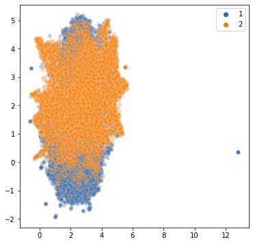
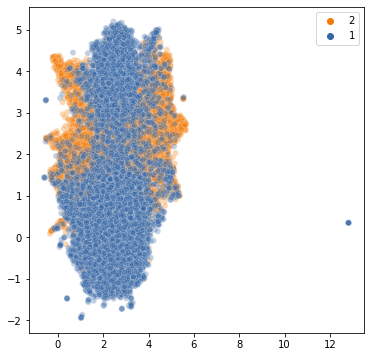
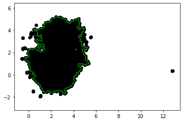
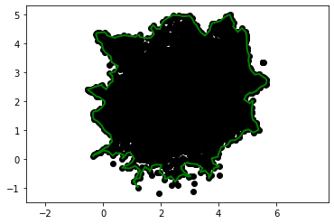
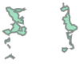

# EML4U AP 2.5 - Protoypen/Archetypen in NLP Darstellungen

In diesem Arbeitspaket wurden Verfahren bereit gestellt, die **repräsentative bzw. extremale Punkte der Einbettung von NLP Daten** bereit stellen.
Der hier vorgestellte Code ist ein **Beispiel** unter Verwendung des Amazon Moview Reviews Datensatzes, Doc2Vec Einbettungen, UMAP-Dimensionsreduktion und geometrischen Operationen. 

<!--
Es werden Verfahren bereit gestellt, die zu reprasentativen bzw. extremalen Punkte der Einbettung von NLP Daten ¨
ein Vokabular bereit stellen. Dieses kann etwa auf Exemplaren beruhen bzw. auf besonders relevanten
Phrasen und sprachlichen Komponenten, die die Positionierung in der Einbettung beeinflussen.
-->

## Vorarbeiten

Dieses Arbeitspaket baut auf den Ergebnissen aus AP 2.2 auf, in dem Verfahren zur Dimensionsreduktion untersucht wurden.
In der folgenden Beispielanwendung wird auf den [Amazon Movie Reviews Datensatz](https://snap.stanford.edu/data/web-Movies.html) zurückgegriffen, der bereits im EML4U-Artikel [Drift Detection in Text Data with Document Embeddings](https://doi.org/10.1007/978-3-030-91608-4_11) Verwendung fand.
Volltexte aus dem Datensatz wurden mit den Ansätzen **BERT** und **Doc2Vec** in Embeddings überführt.
Für eine Dimensionsreduktion der 768- und 50-dimensionalen Embeddings auf 2 Dimensionen fand eine Integration der folgenden Ansätze statt:

- **UMAP**: Uniform Manifold Approximation and Projection for Dimension Reduction
- **t-SNE**: T-distributed Stochastic Neighbor Embedding
- **PCA**: Principal component analysis

## Laden der Daten

Im Folgenden wird auf die Amazon Reviews Volltexte (jeweils **10.000 Texte** die mit **1 bzw. 5 Sternen** bewertet wurden). Doc2Vec-Einbettungen und mit **UMAP** erzeugten **2-dimensionalen Embeddings** zurückgegriffen.


```python
# Reload modules every time before executing the Python code typed
%load_ext autoreload
%autoreload 2

# Import from parent directory
import sys; sys.path.insert(0, '..')

# Configure data storage
from yaml import safe_load
import classes.io
io = classes.io.Io(safe_load(open('../config.yaml', 'r'))['DATA_DIRECTORY'])

# Additional imports
import numpy as np

import matplotlib.pyplot as plt
import seaborn as sns

from classes.geometry import Geometry
from polylidar.polylidarutil import plot_polygons

from classes.clustering import Clustering
```


```python
dataset_id = 'amazon-movie-reviews-10000'
embeddings = io.load_data_pair(dataset_id, io.DATATYPE_EMBEDDINGS, io.DESCRIPTOR_DOC_TO_VEC, 'dim50-epochs50-umap')
texts = io.load_data_pair(dataset_id, io.DATATYPE_TEXT)
```

    Loaded /home/eml4u/EML4U/data/explanation/data/amazon-movie-reviews-10000/doc2vec.dim50-epochs50-umap.embeddings.pickle
    Loaded /home/eml4u/EML4U/data/explanation/data/amazon-movie-reviews-10000/text.pickle


## Vorschau

Die Embeddings werden als **Punktwolke** dargestellt. Jeder Punkt repräsentiert einen Review-Text.


```python
embeddings_a = np.array(list(embeddings.get_a().values()), dtype=float)
embeddings_b = np.array(list(embeddings.get_b().values()), dtype=float)

def plot(data_a, data_b):
    plt.figure(figsize=(6,6))
    plot_data = data_a
    sns.scatterplot(data=plot_data, x=plot_data[:,0], y=plot_data[:,1], palette=['#3465A4'], hue=1, alpha = 0.3)
    plot_data = data_b
    sns.scatterplot(data=plot_data, x=plot_data[:,0], y=plot_data[:,1], palette=['#F57900'], hue=2, alpha = 0.3)

def plot_reverse(data_a, data_b):
    plt.figure(figsize=(6,6))
    plot_data = data_b
    sns.scatterplot(data=plot_data, x=plot_data[:,0], y=plot_data[:,1], palette=['#F57900'], hue=2, alpha = 0.3)
    plot_data = data_a
    sns.scatterplot(data=plot_data, x=plot_data[:,0], y=plot_data[:,1], palette=['#3465A4'], hue=1, alpha = 0.3)
    
plot(embeddings_a, embeddings_b)
plot_reverse(embeddings_a, embeddings_b)
```


    

    


    

    


## Extraktion von Polygonen

Basierend auf den Punktwolken wird eine **Polygonerkennung** ausgeführt.
Hierbei geschieht außerdem eine **Entfernung von Ausreißern**, die sich am Rand oder außerhalb der Polygone befinden.

Anschließend werden die **Überlappungen der Polygone entfernt**, die als Unsicherheiten (nicht sicher zuordbar) eingestuft werden können.
Als Resultat ergeben sich jeweils zwei Polygone aus Punkten für 1- und 5-Stern-Daten.


```python
geometry = Geometry()

# Detect polygons and get indexes of points
polylidar_kwargs = dict(lmax=0.275, min_hole_vertices=1000)
polygon_indexes_a = geometry.extract_polygon_indexes(embeddings_a, polylidar_kwargs=polylidar_kwargs)
polygon_indexes_b = geometry.extract_polygon_indexes(embeddings_b, polylidar_kwargs=polylidar_kwargs)

# Create polygon objects and substract from each other
polygon_a = geometry.create_polygon(embeddings_a, polygon_indexes_a[0])
polygon_b = geometry.create_polygon(embeddings_b, polygon_indexes_b[0])
polygon_a_not_b = polygon_a - polygon_b
polygon_b_not_a = polygon_b - polygon_a

# Plot
def plot_points_polygons(points, polygons):
    fig, ax = plt.subplots(nrows=1, ncols=1)
    ax.scatter(points[:, 0], points[:, 1], c='k')
    plot_polygons(polygons, points, ax)
    plt.axis('equal')
    plt.show()
plot_points_polygons(embeddings_a, geometry.extract_polygons(embeddings_a, polylidar_kwargs=polylidar_kwargs))
plot_points_polygons(embeddings_b, geometry.extract_polygons(embeddings_b, polylidar_kwargs=polylidar_kwargs))
display(polygon_a_not_b)
display(polygon_b_not_a)
```

    /home/eml4u/.local/lib/python3.8/site-packages/descartes/patch.py:63: ShapelyDeprecationWarning: The array interface is deprecated and will no longer work in Shapely 2.0. Convert the '.coords' to a numpy array instead.
      concatenate([asarray(t.exterior)[:, :2]] +


    

    


    

    


    

    


    

    


## Extraktion von repräsentativen Punkten

Entsprechend der semantischen Ähnlichkeit der Embeddings ergeben sich vier Bereiche, die je nach verwendeten Datensätzen entsprechenden **Drift** repräsentieren.
Die Punkte, die in den Bereichen liegen, entsprechen **repräsentativen Punkten** aus 1-Stern bzw. 5-Stern Daten.

In diesem Beispiel wurden aus 10.000 Film-Reviews mit schlechter Bewerung zwei Sammlungen von Texten (Anzahl: 2.204 und 194) extrahiert, deren Inhalte entsprechend der verwendeten Embeddings semantisch ähnlich sind. Dementsprechend sind dies repräsentative Punkte, die als Erklärungen der Stichprobenunterschiede verwendet werden können. Aus 10.000 Film-Reviews mit guter Bewertung wurden 1.023 und 673 Texte extrahiert.

Die Extraktion der Vokabularien und deren visuelle Darstellung wird in AP 2.7 behandelt.

<!--
Es ist jedoch zu beachten, dass durch die vorhergehende Dimensionsreduktion Ungenauigkeiten entstehen können.
-->


```python
# Get points in distinct parts
points_a_not_b = geometry.get_points_in_polygon(embeddings_a, polygon_a_not_b)
points_b_not_a = geometry.get_points_in_polygon(embeddings_b, polygon_b_not_a)
indexes_a_not_b = geometry.get_indexes_of_points_in_polygon(embeddings_a, list(embeddings.get_a().keys()), polygon_a_not_b)
indexes_b_not_a = geometry.get_indexes_of_points_in_polygon(embeddings_b, list(embeddings.get_b().keys()), polygon_b_not_a)
print('no of points:', len(points_a_not_b), len(points_b_not_a))

# Get distinct polygons
clusters_points_a_not_b = Clustering().kmeans(points_a_not_b, indexes_a_not_b)
clusters_points_b_not_a = Clustering().kmeans(points_b_not_a, indexes_b_not_a)
print('clusters found:', len(clusters_points_a_not_b), len(clusters_points_b_not_a))

# Get number of points in polygons
print("1-star", len(clusters_points_a_not_b[0]), len(clusters_points_a_not_b[1]))
print("5-star", len(clusters_points_b_not_a[0]), len(clusters_points_b_not_a[1]))
```

    no of points: 2398 1696
    clusters found: 2 2
    1-star 194 2204
    5-star 1023 673


### Beispiele für Texte aus den Clustern negativer Bewertungen


```python
texts.get_a().get(clusters_points_a_not_b[0][0])
```


    'This DVD would not play due to parameters.  Read carefully ...REGION 2.  Will not play in America.  Total Fail for me!<a href="http://www.amazon.com/gp/product/B000063W1R">The Count of Monte Cristo [Region 2</a>]'


```python
texts.get_a().get(clusters_points_a_not_b[1][0])
```


    "Samurai were not that stupid. I don't particularly like some aspects of classic Japanese culture (excessive obsession over honor and conformity), but the one thing they do better than most other Asian cultures is adapt military technologies when given the opportunity.<br /><br />To imply that there was a group of Japanese Samurai who refused to use fire-arms is retarded. The Japanese have used guns since they first encountered them from the Europeans in the early 1400's, from these they reverse engineered. Japanese Warlords have won the entire country with rifle-men.<br /><br />Historically, there really were a group of samurai who rebelled against a modernizing Japan. And they really did fight to death. And they really did only used swords.<br /><br />But not due to a retarded dogmatic aversion to guns, but because they ran out of gun-powder in their last battle.<br /><br />Also the idea that the last and only surviving samurai would be a white man is insulting."


### Beispiele für Texte aus den Clustern positiver Bewertungen


```python
texts.get_b().get(clusters_points_b_not_a[0][2])
```


    "This video is awesome and of particular interest to anyone who grew up with the great music of the 50's and 60's.  The Duprees were wonderful!  Also, Jay Black's Cara Mia gave me goose bumps.  It doesn't matter how old these guys are, they can still belt out quite a song.  Little Anthony and the Imperials were also very, very good!  They have recaputured the sounds of the music they way we remembered it!  The backup musicians deserve an huge amount of praise. This is one you do not want to miss!  I recommend it HIGHLY!"


```python
texts.get_b().get(clusters_points_b_not_a[1][0])
```


    "I have been a Bee Gees fan for years.  It is really wonderful to see them again.  I love the songs from the new album &quot;This is Where I In&quot;.  It is really great to hear Maurice take the lead in two of the songs, &quot;Man in the Middle&quot; and &quot;Walking on Air&quot;.  While Barry and Robin have beautiful voices, I really enjoy listening to Maurice sing. After all these years, it is really great to see and hear the joy they still get from their music and from preforming together.<br />While precious minutes of the show were taken up with requests, it was still nice to see their interaction with the fans.  I think anyone who is a fan of Barry, Robin and Maurice will enjoy this video.  I have watched it over and over.  It is really sad that we won't have the chance to see the three of them together like this again."


Diese Arbeit wurde vom Bundesministerium für Bildung und Forschung (BMBF) im Rahmen des Projekts [EML4U](https://dice-research.org/EML4U) unter der Kennziffer 01IS19080B gefördert.
