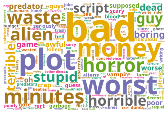
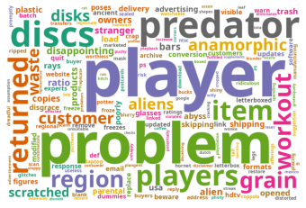
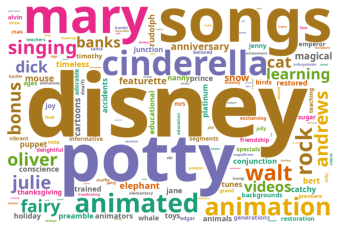

# EML4U AP 2.7 - Schnittstellen für Erklärungen und Visualisierung für Nutzer

In diesem Arbeitspaket wurden Verfahren für Worteinbettungen um **Visualisierungskomponenten** erweitert.

In dem hier vorgestellten Beispiel wird auf die Ergebnisse aus dem Beispiel AP 2.5 zurückgegriffen.
Weiterhin finden sich hier Beispiele zur **Extraktion von Vokabularien**.

<!--
Die in AP2.6 entwickelten Verfahren mussen auf Worteinbettungen basierend auf ¨
dem Vokabular aus (AP2.5) ubertragen werden und um Dom ¨ anen-spezifische Visualisierungskompo- ¨
nenten erweitert werden.
-->

## Einbindung der Ergebnisse aus AP 2.5


```python
# Reload modules every time before executing the Python code typed
%load_ext autoreload
%autoreload 2

# Import from parent directory
import sys; sys.path.insert(0, '..')

# Configure data storage
from yaml import safe_load
import classes.io
io = classes.io.Io(safe_load(open('../config.yaml', 'r'))['DATA_DIRECTORY'])

# Additional imports
import numpy as np

from classes.geometry import Geometry
from classes.clustering import Clustering

from gensim.utils import simple_preprocess
from collections import Counter

import matplotlib.pyplot as plt
from wordcloud import WordCloud, STOPWORDS
```


```python
dataset_id = 'amazon-movie-reviews-10000'
embeddings = io.load_data_pair(dataset_id, io.DATATYPE_EMBEDDINGS, io.DESCRIPTOR_DOC_TO_VEC, 'dim50-epochs50-umap')
texts = io.load_data_pair(dataset_id, io.DATATYPE_TEXT)
```

    Loaded /home/eml4u/EML4U/data/explanation/data/amazon-movie-reviews-10000/doc2vec.dim50-epochs50-umap.embeddings.pickle
    Loaded /home/eml4u/EML4U/data/explanation/data/amazon-movie-reviews-10000/text.pickle


```python
embeddings_a = np.array(list(embeddings.get_a().values()), dtype=float)
embeddings_b = np.array(list(embeddings.get_b().values()), dtype=float)
```


```python
geometry = Geometry()

# Detect polygons and get indexes of points
polylidar_kwargs = dict(lmax=0.275, min_hole_vertices=1000)
polygon_indexes_a = geometry.extract_polygon_indexes(embeddings_a, polylidar_kwargs=polylidar_kwargs)
polygon_indexes_b = geometry.extract_polygon_indexes(embeddings_b, polylidar_kwargs=polylidar_kwargs)

# Create polygon objects and substract from each other
polygon_a = geometry.create_polygon(embeddings_a, polygon_indexes_a[0])
polygon_b = geometry.create_polygon(embeddings_b, polygon_indexes_b[0])
polygon_a_not_b = polygon_a - polygon_b
polygon_b_not_a = polygon_b - polygon_a
```


```python
# Get points in distinct parts
points_a_not_b = geometry.get_points_in_polygon(embeddings_a, polygon_a_not_b)
points_b_not_a = geometry.get_points_in_polygon(embeddings_b, polygon_b_not_a)
indexes_a_not_b = geometry.get_indexes_of_points_in_polygon(embeddings_a, list(embeddings.get_a().keys()), polygon_a_not_b)
indexes_b_not_a = geometry.get_indexes_of_points_in_polygon(embeddings_b, list(embeddings.get_b().keys()), polygon_b_not_a)

# Get distinct polygons
clusters_points_a_not_b = Clustering().kmeans(points_a_not_b, indexes_a_not_b)
clusters_points_b_not_a = Clustering().kmeans(points_b_not_a, indexes_b_not_a)
```

## Extraktion von Vokabularien

Zur Extraktion von Vokabularien wurde auf die **Review-Texte zurückgegriffen**, die den Einbettungen der jeweiligen generierten Punktwolken entsprechen.
Aus den Texten wurden zunächst **Stopwords** entfernt.
Die **Wörter** aus den Dokumenten der Punktwolken wurden **gezählt** und absteigend sortiert.
Abschließend fand eine Entfernung derjenigen Wörter statt, die häufig in der Gesamtheit von 1-Stern bzw. 5-Stern-Texten vorkommen.
Hierdurch entfallen **generische Wörter**, z.B. *movie* und *film*.


```python
def get_tokens(indexes, texts):
    tokens = []
    for index in indexes:
        tokens += simple_preprocess(texts[index], deacc=False, min_len=2, max_len=15)

    stopwords = set(STOPWORDS)
    stopwords.add('br')
    
    tokens = [w for w in tokens if w not in stopwords]
    return Counter(tokens)
```


```python
# Get number of points in polygons
print('1-star docs', len(clusters_points_a_not_b[0]), len(clusters_points_a_not_b[1]))
print('5-star docs', len(clusters_points_b_not_a[0]), len(clusters_points_b_not_a[1]))
print()

tokens_a_not_b = get_tokens(indexes_a_not_b, texts.get_a())
tokens_b_not_a = get_tokens(indexes_b_not_a, texts.get_b())
print('1-star words', len(tokens_a_not_b))
print('5-star words', len(tokens_b_not_a))
print()

counter_a_not_b = Counter(tokens_a_not_b)
counter_b_not_a = Counter(tokens_b_not_a)
print('1-star common words', counter_a_not_b.most_common(20))
print('5-star common words', counter_b_not_a.most_common(20))
```

    1-star docs 2204 194
    5-star docs 1023 673
    
    1-star words 20496
    5-star words 18357
    
    1-star common words [('movie', 6039), ('film', 2751), ('one', 2321), ('even', 1607), ('bad', 1495), ('good', 1256), ('time', 1240), ('don', 1109), ('movies', 1097), ('see', 1089), ('people', 994), ('really', 945), ('make', 911), ('first', 889), ('made', 879), ('will', 871), ('story', 810), ('acting', 793), ('much', 777), ('know', 742)]
    5-star common words [('film', 2061), ('movie', 1831), ('one', 1676), ('michael', 1089), ('will', 1070), ('dvd', 1062), ('see', 985), ('great', 950), ('time', 881), ('disney', 800), ('love', 705), ('well', 680), ('story', 648), ('even', 645), ('best', 639), ('really', 604), ('quot', 603), ('many', 573), ('music', 570), ('good', 568)]


```python
def filter_tokens(counter_x, counter_y, factor=5):
    d = {}
    for token in counter_x.keys():
        if(token in counter_y):
            if(counter_x[token] >= counter_y[token] * factor):
                d[token] = counter_x[token]
    return Counter(d)

tokens_1star_0 = get_tokens(clusters_points_a_not_b[0], texts.get_a()) 
tokens_1star_0_filtered = filter_tokens(Counter(tokens_1star_0), counter_b_not_a)

tokens_1star_1 = get_tokens(clusters_points_a_not_b[1], texts.get_a()) 
tokens_1star_1_filtered = filter_tokens(Counter(tokens_1star_1), counter_b_not_a, 1.5)

tokens_5star_0 = get_tokens(clusters_points_b_not_a[0], texts.get_b()) 
tokens_5star_0_filtered = filter_tokens(Counter(tokens_5star_0), counter_a_not_b, 1.5)

tokens_5star_1 = get_tokens(clusters_points_b_not_a[1], texts.get_b()) 
tokens_5star_1_filtered = filter_tokens(Counter(tokens_5star_1), counter_a_not_b)
```


```python
print('1-star words O', len(tokens_1star_0), len(tokens_1star_0_filtered))
print('1-star words 1', len(tokens_1star_1), len(tokens_1star_1_filtered))
print('5-star words 0', len(tokens_5star_0), len(tokens_5star_0_filtered))
print('5-star words 1', len(tokens_5star_1), len(tokens_5star_1_filtered))
```

    1-star words O 19926 1009
    1-star words 1 3344 174
    5-star words 0 15363 1986
    5-star words 1 8711 146


```python
print('1-star common words 0', tokens_1star_0.most_common(10))
print('1-star common words 0 filtered', tokens_1star_0_filtered.most_common(10))
print()

print('1-star common words 1', tokens_1star_1.most_common(10))
print('1-star common words 1 filtered', tokens_1star_1_filtered.most_common(10))
print()

print('5-star common words 0', tokens_5star_0.most_common(10))
print('5-star common words 0 filtered', tokens_5star_0_filtered.most_common(10))
print()

print('5-star common words 1', tokens_5star_1.most_common(10))
print('5-star common words 1 filtered', tokens_5star_1_filtered.most_common(10))
```

    1-star common words 0 [('movie', 5858), ('film', 2638), ('one', 2213), ('even', 1522), ('bad', 1466), ('good', 1198), ('time', 1164), ('don', 1059), ('movies', 1057), ('see', 1031)]
    1-star common words 0 filtered [('bad', 1466), ('plot', 697), ('worst', 585), ('money', 510), ('minutes', 495), ('horror', 472), ('waste', 423), ('alien', 396), ('horrible', 383), ('guy', 361)]
    
    1-star common words 1 [('dvd', 374), ('movie', 181), ('blu', 138), ('ray', 131), ('film', 113), ('will', 112), ('one', 108), ('amazon', 105), ('version', 93), ('disc', 90)]
    1-star common words 1 filtered [('player', 63), ('problem', 46), ('predator', 30), ('discs', 27), ('players', 27), ('item', 24), ('returned', 24), ('region', 17), ('workout', 17), ('grain', 16)]
    
    5-star common words 0 [('film', 1526), ('movie', 1181), ('one', 1119), ('michael', 1040), ('see', 781), ('will', 715), ('great', 600), ('time', 536), ('jackson', 506), ('well', 473)]
    5-star common words 0 filtered [('michael', 1040), ('great', 600), ('jackson', 506), ('music', 400), ('mj', 315), ('performance', 313), ('concert', 309), ('john', 287), ('samurai', 213), ('doubt', 213)]
    
    5-star common words 1 [('disney', 787), ('movie', 650), ('dvd', 596), ('one', 557), ('film', 535), ('potty', 426), ('pinocchio', 414), ('will', 355), ('songs', 354), ('great', 350)]
    5-star common words 1 filtered [('disney', 787), ('potty', 426), ('songs', 354), ('mary', 226), ('cinderella', 202), ('animated', 197), ('animation', 187), ('rock', 150), ('walt', 143), ('singing', 105)]


## Wordcloud Visualisierung

Als Visualisierungskomponente wird auf Wordclouds zurückgegriffen.
Die Schriftgröße einzelner Wörter repräsentiert hier die Worthäufigkeit, Farben haben keine Bedeutung.

Als Resultat dieses Beispieldatensatzes ergeben sich vier Wordclouds:

- **1-Stern Fall A**: Negative Adjektive, z.B. bad, worst, waste, terrible
- **1-Stern Fall B**: Beschreibung von Fehlern bei Abspielgeräten, also eine Bewertung der Filmdistribution
- **5-Stern Fall A**: Michael Jackson / Musik
- **5-Stern Fall B**: Disney / Animationsfilme

Als Folgearbeiten bietet sich eine Filterung nach Adjektiven an.
Außerdem scheint die Extraktion von Vokabularen nach Zeiträumen (z.b. Jahre) vielversprechend, die anschließend zusammengesetzt werden, um temporäre Effekte (z.B. Popularität einzelner Schauspieler:innen in einzelnen Jahren) zu minimieren.


```python
def print_wordcould(counts):
    font_path='/usr/share/fonts/truetype/noto/NotoSans-Bold.ttf' #  fc-list | grep 'NotoSans-Bold'
    wordcloud = WordCloud(background_color="white", font_path=font_path, colormap='Dark2', width=1200, height=800).generate_from_frequencies(counts)
    plt.imshow(wordcloud)
    plt.axis("off")
```


```python
print_wordcould(tokens_1star_0_filtered)
```


    

    


```python
print_wordcould(tokens_1star_1_filtered)
```


    

    


```python
print_wordcould(tokens_5star_0_filtered)
```


    

    


```python
print_wordcould(tokens_5star_1_filtered)
```


    

    


Diese Arbeit wurde vom Bundesministerium für Bildung und Forschung (BMBF) im Rahmen des Projekts [EML4U](https://dice-research.org/EML4U) unter der Kennziffer 01IS19080B gefördert.
